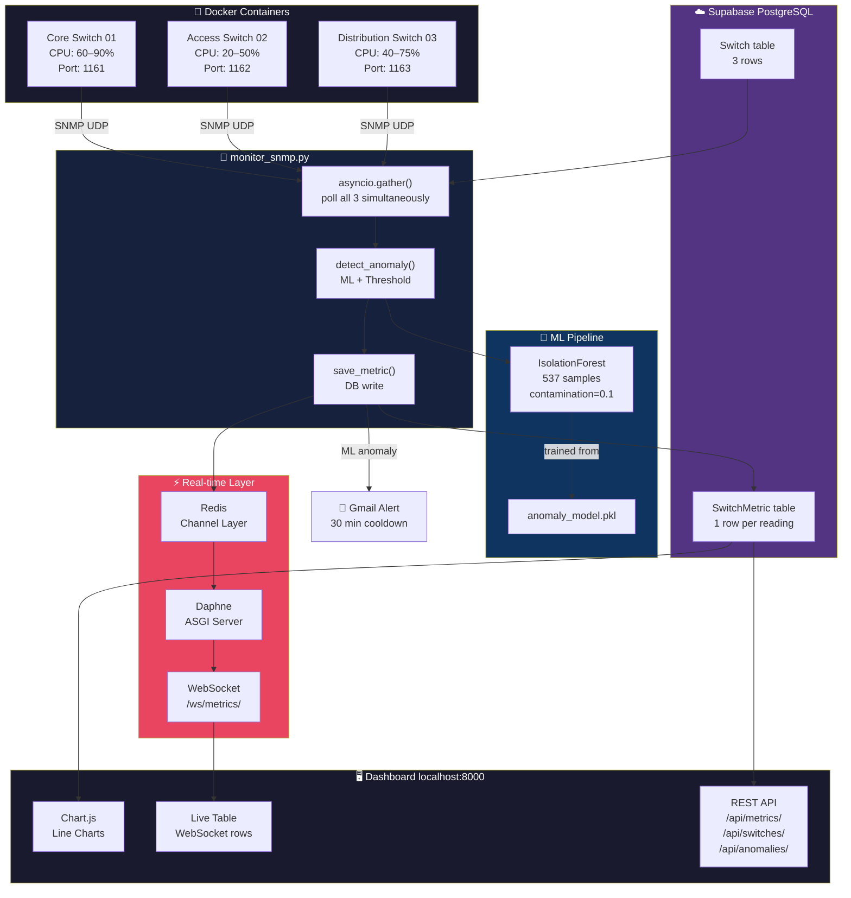

```mermaid
flowchart TD
    subgraph Docker["🐳 Docker Containers"]
        S1["Core Switch 01\nCPU: 60–90%\nPort: 1161"]
        S2["Access Switch 02\nCPU: 20–50%\nPort: 1162"]
        S3["Distribution Switch 03\nCPU: 40–75%\nPort: 1163"]
    end

    subgraph Monitor["📡 monitor_snmp.py"]
        POLL["asyncio.gather()\npoll all 3 simultaneously"]
        DETECT["detect_anomaly()\nML + Threshold"]
        SAVE["save_metric()\nDB write"]
    end

    subgraph ML["🧠 ML Pipeline"]
        MODEL["IsolationForest\n537 samples\ncontamination=0.1"]
        PKL["anomaly_model.pkl"]
    end

    subgraph Storage["☁️ Supabase PostgreSQL"]
        SW["Switch table\n3 rows"]
        SM["SwitchMetric table\n1 row per reading"]
    end

    subgraph Realtime["⚡ Real-time Layer"]
        REDIS["Redis\nChannel Layer"]
        DAPHNE["Daphne\nASGI Server"]
        WS["WebSocket\n/ws/metrics/"]
    end

    subgraph Frontend["🖥️ Dashboard localhost:8000"]
        CHART["Chart.js\nLine Charts"]
        TABLE["Live Table\nWebSocket rows"]
        API["REST API\n/api/metrics/\n/api/switches/\n/api/anomalies/"]
    end

    EMAIL["📧 Gmail Alert\n30 min cooldown"]

    S1 & S2 & S3 -->|SNMP UDP| POLL
    POLL --> DETECT
    DETECT --> MODEL
    MODEL -->|trained from| PKL
    DETECT --> SAVE
    SAVE --> SM
    SW --> POLL
    SAVE --> REDIS
    REDIS --> DAPHNE
    DAPHNE --> WS
    WS --> TABLE
    SM --> CHART
    SM --> API
    SAVE -->|ML anomaly| EMAIL

    style Docker fill:#1a1a2e,color:#fff
    style Monitor fill:#16213e,color:#fff
    style ML fill:#0f3460,color:#fff
    style Storage fill:#533483,color:#fff
    style Realtime fill:#e94560,color:#fff
    style Frontend fill:#1a1a2e,color:#fff
```