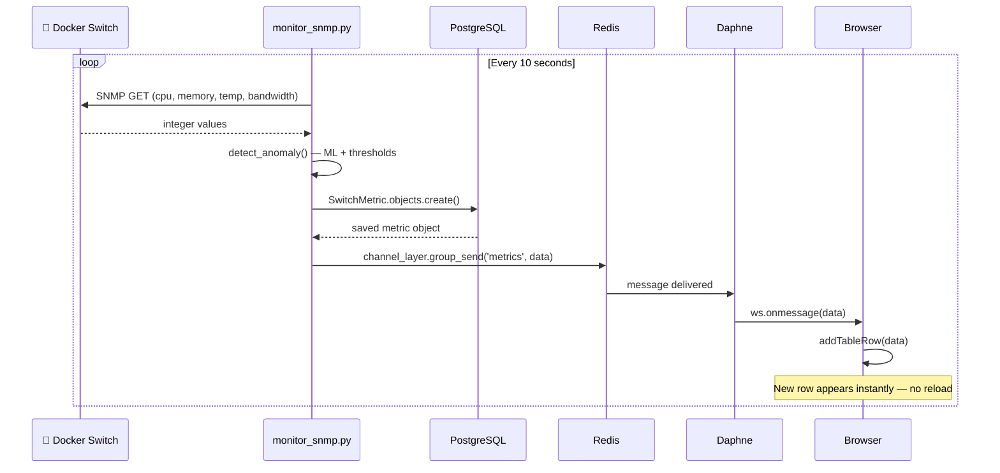

```mermaid
sequenceDiagram
    participant Docker as 🐳 Docker Switch
    participant Monitor as monitor_snmp.py
    participant DB as PostgreSQL
    participant Redis as Redis
    participant Daphne as Daphne
    participant Browser as Browser

    loop Every 10 seconds
        Monitor->>Docker: SNMP GET (cpu, memory, temp, bandwidth)
        Docker-->>Monitor: integer values
        Monitor->>Monitor: detect_anomaly() — ML + thresholds
        Monitor->>DB: SwitchMetric.objects.create()
        DB-->>Monitor: saved metric object
        Monitor->>Redis: channel_layer.group_send('metrics', data)
        Redis->>Daphne: message delivered
        Daphne->>Browser: ws.onmessage(data)
        Browser->>Browser: addTableRow(data)
        Note over Browser: New row appears instantly — no reload
    end
```