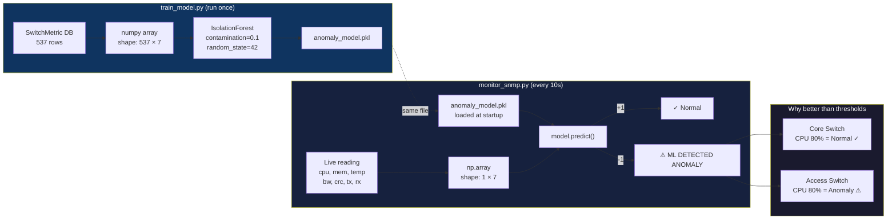

```mermaid
flowchart LR
    subgraph Train["train_model.py (run once)"]
        DB1["SwitchMetric DB\n537 rows"] --> NP["numpy array\nshape: 537 × 7"]
        NP --> FIT["IsolationForest\ncontamination=0.1\nrandom_state=42"]
        FIT --> PKL["anomaly_model.pkl"]
    end

    subgraph Predict["monitor_snmp.py (every 10s)"]
        LIVE["Live reading\ncpu, mem, temp\nbw, crc, tx, rx"] --> ARR["np.array\nshape: 1 × 7"]
        PKL2["anomaly_model.pkl\nloaded at startup"] --> PRED
        ARR --> PRED["model.predict()"]
        PRED -->|"+1"| NORMAL["✓ Normal"]
        PRED -->|"-1"| ANOMALY["⚠ ML DETECTED ANOMALY"]
    end

    subgraph Why["Why better than thresholds"]
        C1["Core Switch\nCPU 80% = Normal ✓"]
        C2["Access Switch\nCPU 80% = Anomaly ⚠"]
    end

    PKL -.->|same file| PKL2
    ANOMALY --> C1
    ANOMALY --> C2

    style Train fill:#0f3460,color:#fff
    style Predict fill:#16213e,color:#fff
    style Why fill:#1a1a2e,color:#fff
```