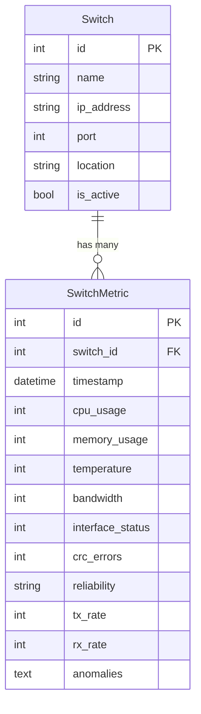

```mermaid
erDiagram
    Switch {
        int id PK
        string name
        string ip_address
        int port
        string location
        bool is_active
    }

    SwitchMetric {
        int id PK
        int switch_id FK
        datetime timestamp
        int cpu_usage
        int memory_usage
        int temperature
        int bandwidth
        int interface_status
        int crc_errors
        string reliability
        int tx_rate
        int rx_rate
        text anomalies
    }

    Switch ||--o{ SwitchMetric : "has many"
```