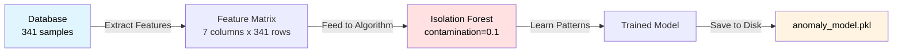
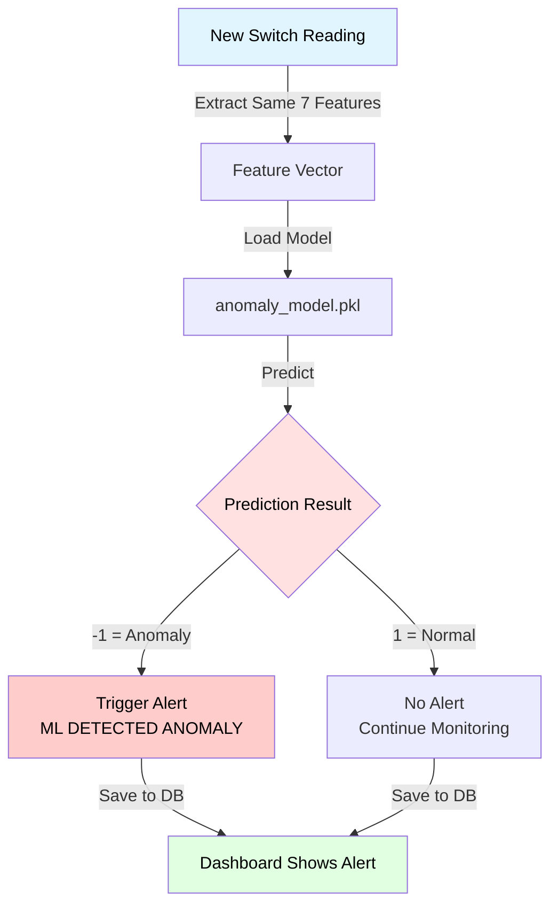

# ML Anomaly Detection Workflow

## Training Phase (One-time / Periodic)

**Features Used:**
- CPU Usage (%)
- Memory Usage (%)
- Temperature (°C)
- Bandwidth (Mbps)
- CRC Errors (count)
- TX Rate (Mbps)
- RX Rate (Mbps)

---

## Prediction Phase (Real-time)

## How Isolation Forest Works (Simplified)

**Concept:** Anomalies are easier to isolate (separate) than normal points.

**Example:**
- Normal data: clustered together (like a crowd)
- Anomaly: standing alone (easy to isolate with 1-2 cuts)

**Algorithm:**
1. Build random decision trees
2. Count how many cuts needed to isolate each point
3. Anomalies need fewer cuts (low score) → flag as -1
4. Normal points need many cuts (high score) → return 1

**Why contamination=0.1?**
- Tells algorithm: "expect 10% of data to be anomalies"
- Adjusts sensitivity threshold