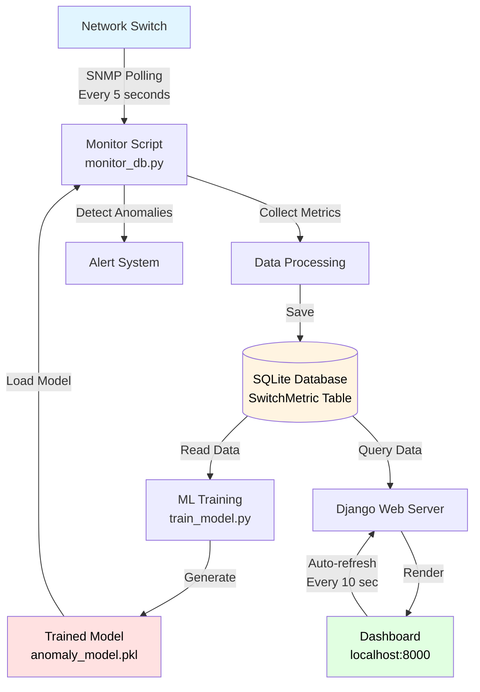

# System Architecture

## High-Level Overview

## Data Flow

**Phase 1: Data Collection**
1. Monitor script polls switch metrics (simulated currently)
2. Collects: CPU, Memory, Temperature, Bandwidth, Interface status, CRC errors, TX/RX rates
3. Saves to database with timestamp

**Phase 2: ML Training**
1. Training script reads historical data (minimum 50 samples)
2. Trains Isolation Forest model
3. Saves trained model to pickle file

**Phase 3: Real-time Detection**
1. Monitor loads trained model
2. For each new reading: ML predicts normal (1) or anomaly (-1)
3. Threshold checks run in parallel (backup)
4. Anomalies saved to database

**Phase 4: Visualization**
1. Django reads latest data from database
2. Renders dashboard with metrics table
3. Highlights ML-detected anomalies in yellow
4. Page auto-refreshes every 10 seconds