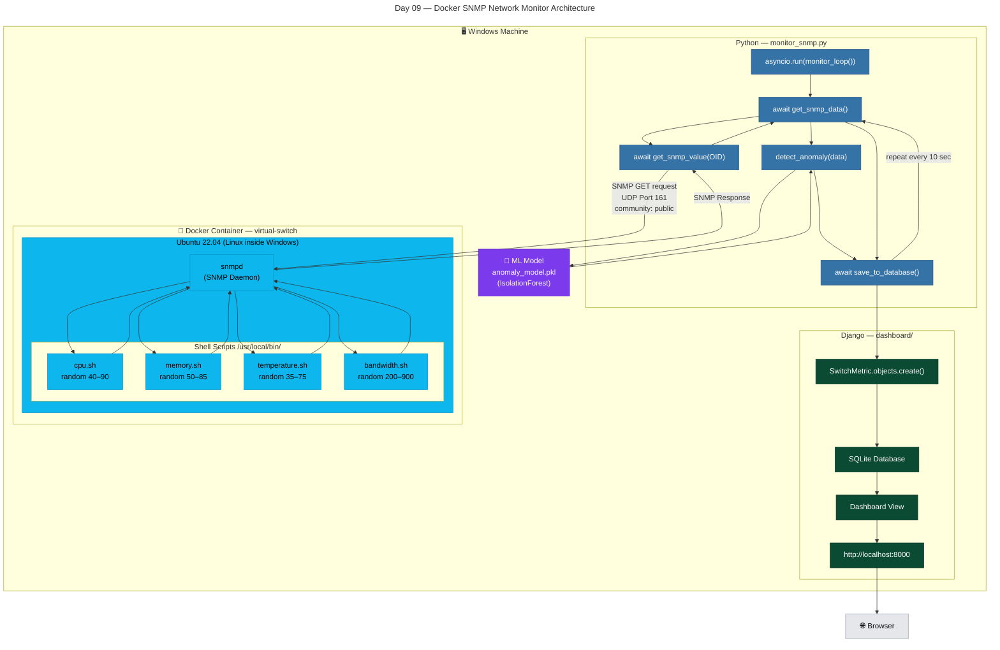

# Day 09 — Docker + SNMP Integration
**Date:** 2026-05-14
**Tata Prakshikshan Internship | Network Monitor AI Project**

---

## Big Picture — What Changed Today

Before Day 09, the monitor script (`monitor_snmp.py`) had no real SNMP source to talk to.
The plan was to use `snmpsim` (a Python package that fakes a switch), but it didn't work on Windows.

**The fix:** Run a real SNMP agent inside a Docker container on your own machine.

```
Before:                         After:
monitor_snmp.py                 monitor_snmp.py
 → tries to poll 127.0.0.1:1611 → sends real SNMP GET (UDP port 161)
 → nothing is there, crashes     → Docker container (Ubuntu + snmpd) responds
                                 → value saved to Django DB
                                 → Dashboard shows it
```

This is the **same architecture** as polling a real Cisco switch.
The only difference: a real Cisco switch reads from hardware.
Our container reads from a shell script that generates a number.
The network protocol (`SNMP over UDP`) is identical and real.

---

## Concept 1 — What is Docker (Beginner Explanation)

Docker lets you run a mini Linux computer *inside your Windows machine*, completely isolated.

**Analogy:**
Think of it like this:
- A **Docker Image** = a recipe / blueprint (like a `.exe` installer file)
- A **Docker Container** = the actual running program created from that image

```
Dockerfile  →  docker build  →  Image (blueprint stored on disk)
Image       →  docker run    →  Container (actually running, has its own Linux OS)
```

You can start, stop, delete containers without affecting your Windows system.
This is why companies love Docker — "it works on my machine" becomes "it works everywhere."

**Why we used it:**
- `snmpsim` (Plan A) had Windows compatibility issues
- Docker runs Ubuntu Linux inside Windows cleanly
- `snmpd` (the real SNMP daemon) is a Linux tool → runs perfectly in Docker
- Bonus: Docker is a highly valued skill on resume

---

## Concept 2 — What is SNMP (Quick Reminder)

**Simple Network Management Protocol** — used by IT teams to monitor network devices.

```
Your Python script asks:   "Hey switch, what's your CPU usage?" (SNMP GET request)
The switch/container says: "It's 67%"                          (SNMP response)
```

- Uses **UDP port 161**
- Authentication uses a "community string" — we used `"public"` (read-only access)
- Each metric has an **OID** (Object Identifier) — like a specific address for each data point

---

## Files We Created

```
network-monitor-ai/
└── docker-snmp/
    ├── Dockerfile          ← instructions to build the container
    ├── snmpd.conf          ← SNMP agent config (what to expose, what community string)
    └── scripts/
        ├── cpu.sh          ← generates a random-ish CPU value each time polled
        ├── memory.sh       ← generates a random-ish memory value
        ├── temperature.sh  ← generates a random-ish temperature value
        └── bandwidth.sh    ← generates a random-ish bandwidth value
```

**Dockerfile (simplified explanation):**
```dockerfile
FROM ubuntu:22.04          # start with Ubuntu Linux
RUN apt-get install snmpd  # install SNMP daemon (the agent)
COPY scripts/ ...          # copy our shell scripts into the container
COPY snmpd.conf ...        # copy our config
CMD ["snmpd", "-f", ...]   # when container starts, run snmpd
```

**One shell script example (cpu.sh):**
```bash
#!/bin/sh
echo $((40 + $(od -An -N2 -tu2 /dev/urandom) % 51))
# Generates a number between 40 and 90
```

---

## Docker Commands — Cheat Sheet

| Command | What It Does | When to Use It |
|---------|-------------|----------------|
| `docker build -t snmp-switch .` | Build image from Dockerfile | After changing Dockerfile or scripts |
| `docker run -d -p 161:161/udp --name virtual-switch snmp-switch` | Create and start container | First time only |
| `docker ps` | List running containers | Check if container is alive |
| `docker start virtual-switch` | Start a stopped container | After restarting PC |
| `docker stop virtual-switch` | Stop running container | When done for the day |
| `docker rm virtual-switch` | Delete container entirely | Before rebuilding |
| `docker logs virtual-switch` | See what container is printing | Debugging |
| `docker exec -it virtual-switch /bin/bash` | Open a terminal inside container | Debugging scripts inside |

**Daily startup sequence (after PC restart):**
```bash
# 1. Open Docker Desktop, wait for green status
# 2. Then in terminal:
docker start virtual-switch
```

---

## How to Run the Full Project

```
Terminal 1 (in network-monitor-ai/):
    docker start virtual-switch
    python src/monitor_snmp.py

Terminal 2 (in network-monitor-ai/):
    python manage.py runserver

Browser:
    http://localhost:8000
```

---

## Obstacles Faced (Read This Before Interviews)

### Obstacle 1 — snmpsim Completely Failed on Windows

**What happened:**
The original plan was to use `snmpsim` to fake a switch.
Every command tried gave a different error:

```
snmpsimd.py                              → not recognized
python -m snmpsim.commands.snmpsimd      → module not found
snmpsim-command-responder                → wrong parameter syntax error
```

**Why it failed:** `snmpsim` is designed for Linux. Windows support is broken/incomplete.

**Solution:** Switched entirely to Docker + Net-SNMP.
This was actually the better choice — more professional, industry-standard, and resume-worthy.

---

### Obstacle 2 — pysnmp Import Error (Deprecated Package)

**What happened:**
Running `monitor_snmp.py` gave:
```
NameError: name 'getCmd' is not defined
```
Then after investigating:
```
RuntimeWarning: The 'pysnmp-lextudio' package is deprecated
```

**Why it happened:**
Had the wrong (old, deprecated) version of pysnmp installed.
`pysnmp-lextudio` is an old fork that dropped `getCmd` from exports.

**Solution:**
```bash
pip uninstall pysnmp pysnmp-lextudio -y
pip install pysnmp==7.1.10
```

---

### Obstacle 3 — pysnmp v7 Changed Its Entire API

**What happened:**
After installing v7, got:
```
ImportError: cannot import name 'getCmd' from 'pysnmp.hlapi'
```

**Why it happened:**
pysnmp v7 is a complete rewrite. It uses `async/await` (asynchronous programming).
The old `getCmd` function became `get_cmd`.
Old transport setup changed too.

**Solution — rewrote imports and function style:**
```python
# Old (v6) — synchronous:
from pysnmp.hlapi import getCmd, SnmpEngine, CommunityData ...
errorIndication, errorStatus, errorIndex, varBinds = next(iterator)

# New (v7) — asynchronous:
from pysnmp.hlapi.v3arch.asyncio import *
errorIndication, errorStatus, errorIndex, varBinds = await get_cmd(
    snmpEngine,
    CommunityData('public'),
    await UdpTransportTarget.create(('127.0.0.1', 161), timeout=2, retries=1),
    ...
)
```

The whole monitoring loop had to become `async def monitor_loop()` and run with `asyncio.run()`.

---

### Obstacle 4 — Django Crashed Inside Async Code

**What happened:**
After fixing pysnmp, a new crash appeared when trying to save to database:
```
django.core.exceptions.SynchronousOnlyOperation:
You cannot call this from an async context - use a thread or sync_to_async.
```

**Why it happened:**
Django's ORM (database layer) is synchronous (normal, blocking code).
Our monitor loop became async (because of pysnmp v7).
Django refused to run inside an async context.

**Solution — wrap database save in `sync_to_async`:**
```python
from asgiref.sync import sync_to_async

async def save_to_database(data, anomalies):
    @sync_to_async
    def create_metric():
        return SwitchMetric.objects.create(
            cpu_usage=data['cpu_usage'],
            # ... rest of fields
        )
    return await create_metric()

# Inside monitor_loop:
metric = await save_to_database(data, anomalies)
```

`sync_to_async` acts as a bridge — it runs the Django database code in a separate thread, so async and sync can cooperate.

---

### Obstacle 5 — Docker Container Returned Static Values (Always 40, 35, 50)

**What happened:**
Everything was connected and working, but every single poll returned the exact same values:
```
CPU: 40% | Temp: 35C | Mem: 50%
CPU: 40% | Temp: 35C | Mem: 50%
CPU: 40% | Temp: 35C | Mem: 50%
```

**Diagnosis process:**
Connected inside the running container using:
```bash
docker exec -it virtual-switch /bin/bash
```
Then manually ran the script:
```bash
/usr/local/bin/cpu.sh   # output: 40
/usr/local/bin/cpu.sh   # output: 40
/usr/local/bin/cpu.sh   # output: 40
```

**Why it happened:**
The scripts used `$RANDOM` which is a **bash-only** variable.
The container's default shell is `/bin/sh` (not bash).
In `/bin/sh`, `$RANDOM` is always 0, so `40 + 0 = 40` every time.

**Confirmed the fix inside container:**
```bash
echo $((40 + $(od -An -N2 -tu2 /dev/urandom) % 51))
# output: 87
# output: 52
# output: 76  ← different every time!
```

`/dev/urandom` is a Linux virtual file that outputs random bytes. Works in all shells.

**Solution — updated all 4 scripts:**
```bash
# Old (broken):
echo $((40 + RANDOM % 51))

# New (working):
echo $((40 + $(od -An -N2 -tu2 /dev/urandom) % 51))
```

Then rebuilt the container to pick up the changes:
```bash
docker stop virtual-switch
docker rm virtual-switch
docker build -t snmp-switch .
docker run -d -p 161:161/udp --name virtual-switch snmp-switch
```

---

## "Is This Cheating?" — Are We Just Using Random Numbers?

You might wonder: *"We're just generating random numbers — how is this real monitoring?"*

**Answer:** The randomness is in the data source, not the protocol.

```
Real scenario:
Python → SNMP GET (UDP 161) → Cisco Switch → reads actual hardware sensor → returns 67%

Our scenario:
Python → SNMP GET (UDP 161) → Docker (snmpd) → runs cpu.sh → returns 67%
```

The SNMP GET request, UDP packet, community string authentication, OID lookup, and response — all of that is **real and identical** to polling a real switch.

The shell script generating a number is equivalent to the switch's hardware sensor outputting a number. The surrounding protocol is what matters for the demo and for learning.

Think of it like this: flight simulators don't have real engines, but pilots learn real flying skills. We have a real SNMP stack, we're learning real monitoring architecture.

---

## What Changed in monitor_snmp.py (Summary)

| What | Before | After |
|------|--------|-------|
| Import style | `from pysnmp.hlapi import *` | Explicit async imports from v3arch |
| Function style | Synchronous `def` | Async `async def` with `await` |
| Port | 1611 (snmpsim) | 161 (Docker standard SNMP) |
| DB save | Direct `SwitchMetric.objects.create()` | Wrapped in `sync_to_async` |
| Error handling | Minimal | Try/except with printed messages |

---

## What to Add/Keep in .gitignore

```gitignore
# Docker
docker-snmp/scripts/*.sh.bak

# VS Code
.vscode/

# OS files
.DS_Store
Thumbs.db

# Jupyter
.ipynb_checkpoints/

# Build / distribution
build/
dist/
*.egg-info/

# Coverage / testing
.coverage
htmlcov/
.pytest_cache/

# CSV / data
data/

# ML models
*.pkl

# SNMP simulation data
snmp_data/
```

Keep `docker-snmp/` folder tracked in git — it's your actual code.

---

## What to Add to requirements.txt

```
Django>=5.0
scikit-learn>=1.4
numpy>=1.24
pysnmp>=7.0
asgiref>=3.7
```

(`asgiref` provides `sync_to_async` — add it explicitly.)

---

## Interview Answer — "What Challenges Did You Face?"

> "Our first plan was to use snmpsim for virtual switch simulation, but it had Windows compatibility issues — the CLI commands either weren't recognized or had wrong syntax.
>
> We switched to Docker running Net-SNMP, which was actually a better decision — more professional and taught me containerization concepts.
>
> The biggest technical challenge was pysnmp v7's breaking API change — the entire library switched from synchronous to async/await. This cascaded into a second issue: Django's ORM is synchronous and refused to run inside an async context, throwing a `SynchronousOnlyOperation` error. We resolved it using asgiref's `sync_to_async` wrapper.
>
> We also debugged a subtle shell scripting issue — `$RANDOM` only works in bash, not `/bin/sh`. The Docker container's scripts were returning the same value every time because `/bin/sh` treats `$RANDOM` as zero. Fixed it using `/dev/urandom`, which works in all shells."

---

## What I Understood vs Copy-Pasted

**Genuinely understood:**
- Why Docker exists and what containers vs images are
- SNMP protocol flow (GET request → OID → response)
- Why `$RANDOM` failed (`/bin/sh` vs `bash`)
- Why `/dev/urandom` works
- The difference between "random data source" and "real protocol"

**Copied and pasted (need to learn later):**
- `async/await` internals (how Python async works under the hood)
- `sync_to_async` mechanics (threading model behind it)
- pysnmp v7 API details beyond what we used

**YouTube to watch on weekend:**
- "Docker in 100 seconds" — Fireship (2 min, perfect mental model)
- "Python async await explained" — Tech With Tim or Corey Schafer

-----------------------------------
-----------------------------------
